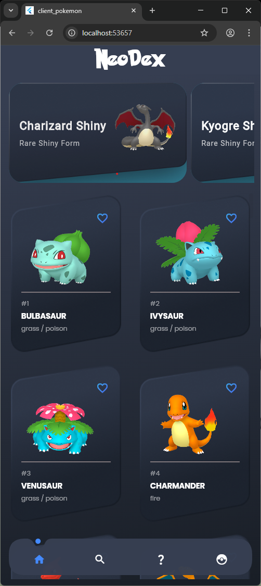
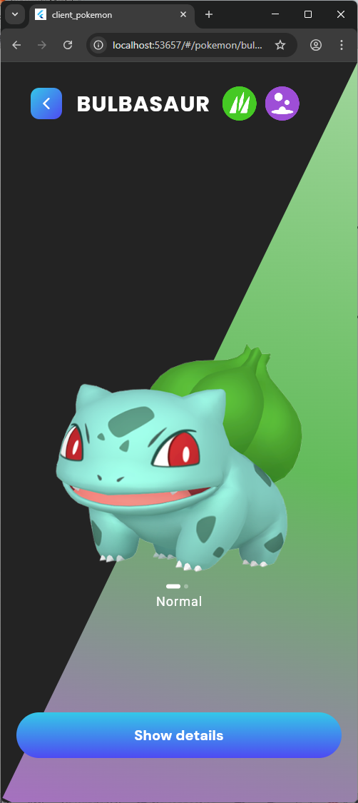
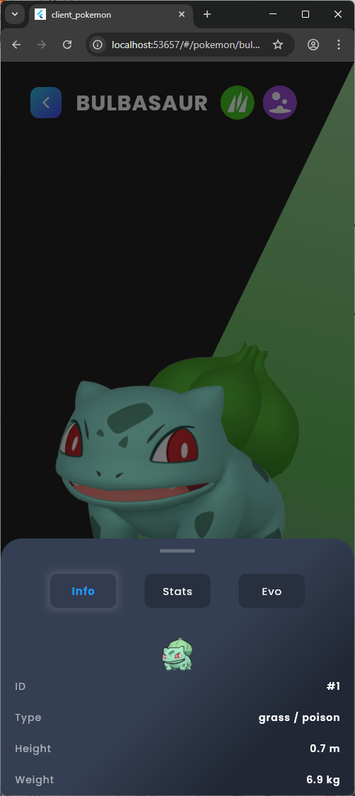
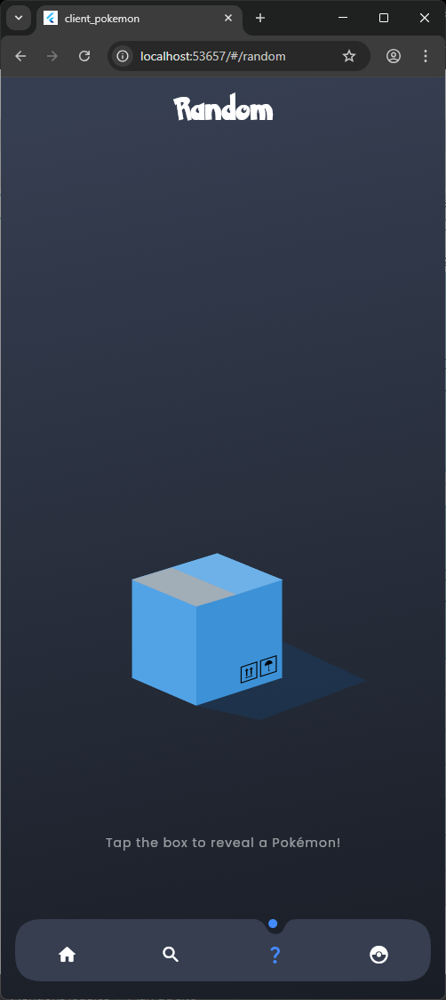
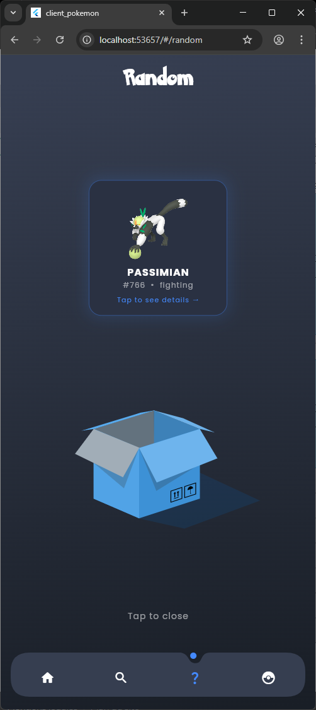
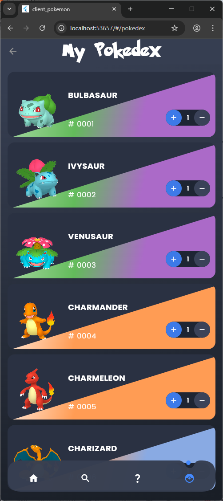

# 🔴 NeoDex — Pokémon App

## 📱 App Preview

<div align="center">

  <table>
    <tr>
      <td></td>
      <td></td>
      <td></td>
    </tr>
    <tr>
      <td></td>
      <td></td>
      <td></td>
    </tr>
  </table>

</div>

> A full-stack Pokémon application built with Flutter & Node.js.  
> Browse all 1025 Pokémons, discover their Shiny forms, search by name/type/ID, manage your personal Pokédex and get a random Pokémon!

## 🛠️ Tech Stack

- **Client** : Flutter / Dart — Architecture Feature-First (Data, Domain, Application, Presentation)
- **State Management** : Riverpod
- **Navigation** : GoRouter
- **Server** : Node.js / Express — MVC Architecture
- **Database** : MongoDB + JSON file
- **API Documentation** : Swagger (OpenAPI 3.0)
- **Animations** : Lottie

## ✨ Features

- 📋 Full Pokémon list with carousel of featured Shinies
- 🔍 Multi-criteria search (name, Pokédex number, type)
- 📄 Detail page with Normal / Shiny version switcher
- 📊 Stats, abilities and evolution chain per Pokémon
- 🎲 Random Pokémon reveal with animated box (Lottie)
- 📦 Personal Pokédex with counter per Pokémon
- 💙 Favorites system

## 📁 Project Structure
```
POKEMON/
├── clientPokemon/             # Flutter mobile application
│   └── lib/src/
│       ├── features/pokemon/
│       │   ├── data/          # API service (pokemon_service.dart)
│       │   ├── domain/        # Data models (Pokemon, Evolution, Sprites…)
│       │   └── presentation/  # Screens & Widgets
│       ├── constants/         # Colors, sizes
│       ├── routes/            # GoRouter configuration
│       └── theme/             # App theme
├── serverPokemon/             # Node.js REST API + Swagger
│   ├── controllers/           # pokemonController.js
│   ├── models/                # pokemon.js (Mongoose schema)
│   ├── routes/                # pokemonRoutes.js
│   ├── app.js                 # Entry point
│   ├── swagger.js             # Swagger config
│   └── swagger.yaml           # OpenAPI 3.0 spec
└── pokemon.pokemons.json      # MongoDB JSON database (1025 Pokémons)
```

## ⚙️ Installation

### Prerequisites

- [Node.js](https://nodejs.org/)
- [MongoDB](https://www.mongodb.com/)
- [Flutter SDK](https://flutter.dev/)

### Server
```bash
cd serverPokemon
npm install
npm start
```

> The server runs on **http://localhost:3000**

### Import the database

Import `pokemon.pokemons.json` into your local MongoDB instance:
```bash
mongoimport --db pokemon --collection pokemons --file pokemon.pokemons.json --jsonArray
```

### Client
```bash
cd clientPokemon
flutter pub get
flutter run
```

## 📖 API Documentation

Once the server is running, the Swagger documentation is available at:
```
http://localhost:3000/poke
```

### Available endpoints

| Method | Endpoint | Description |
|--------|----------|-------------|
| GET | `/pokemons` | Get all Pokémons |
| GET | `/pokemons/:id` | Get a Pokémon by MongoDB ID |

## 📱 App Preview

| Home | Detail | Shiny | Search | Random | Pokédex |
|------|--------|-------|--------|--------|---------|
| Pokémon list with carousel | Normal & Shiny switcher | Type-based gradient | Name / number / type | Animated box reveal | Personal counter |

## 🧪 Unit Tests

Unit tests are implemented for the core data models:
```bash
cd clientPokemon
flutter test
```

Tests cover: `Pokemon`, `Abilitie`, `Evolution` models.

## 👤 Author

- GitHub : [@kaitoooooooooooooooooooo](https://github.com/kaitoooooooooooooooooooo)